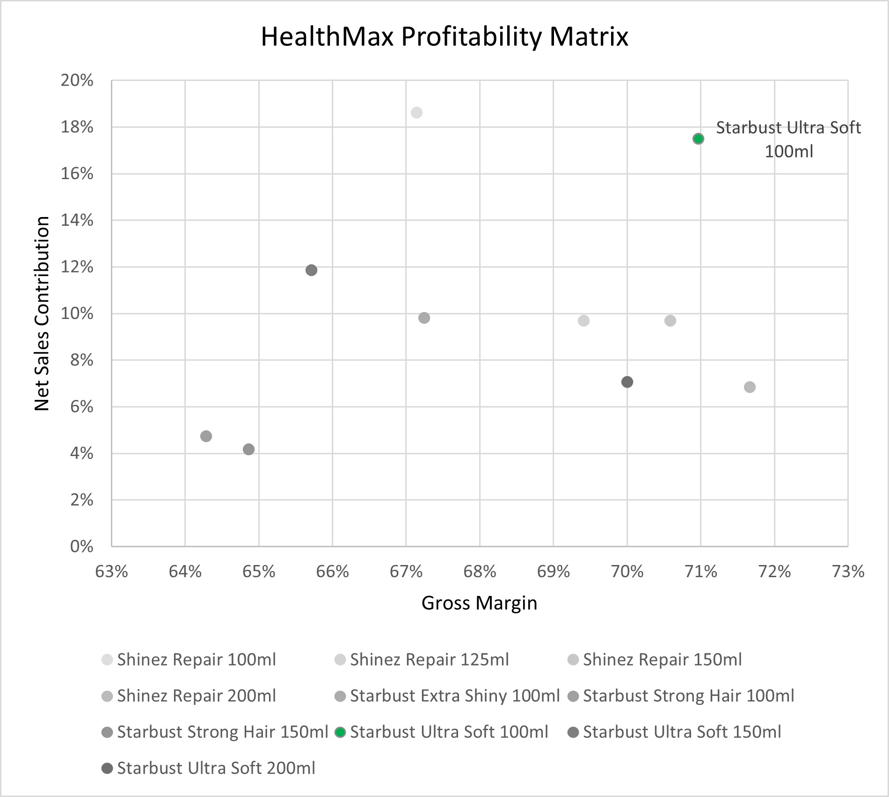

# Net Revenue Management in Excel

## Problem

HealthMax, a top Fast Moving Consumer Goods (FMCG) company in the shampoo market, struggles to maximize revenue and profit due to rising competition and changing consumer preferences. The company needs better pricing and product mix strategies to stay competitive, strengthen its brand, and grow sustainably.

## Executive Summary

By focusing on high-performing products, exploring new subcategories, and optimizing pricing strategies, HealthMax can strengthen its market position, drive revenue growth, and meet evolving consumer demands.

1. Market Performance:

    - HealthMax grew by 4% in 2020, reversing a decline seen in 2019. Its brand Shinez drove this growth with a 7.7% increase, offsetting earlier losses.

    - The shampoo category generated over $98 million in revenue from April 2022 to March 2023.

    - HealthMax dominates the South region with a 47% market share, outperforming other areas.

2. Product Performance:

    - In 2022, HealthMax achieved  20 million in net sales, with Starburst Ultra Soft as the top product, selling 1 million units and generating 3.5 million.

    - The shampoo portfolio has a strong gross margin of 69%, with Starburst Ultra Soft 100ml being the most profitable product.

3. New Growth Opportunity:

   - HealthMax operates in only 2 of 5 shampoo subcategories. The Organic subcategory is growing rapidly at 276% and is projected to reach 1 million units by 2024, offering a significant expansion opportunity.

4. Revenue Optimization:

    - HealthMax can target travelers by launching a 50ml version of its best-selling product, Starburst Ultra Soft.

    - The 50ml format is estimated to generate $265,960 in net sales, with a retail price based on a 50% markup of the 100ml pack’s price per ml.

## Insights Deep Dive

### Fast Moving Consumer Goods

In 2020, HealthMax achieved 4% growth, reversing the decline seen by its top competitors in 2019. This growth was largely driven by Shinez, one of its flagship brands, which grew by 7.7%, offsetting a -5% decline from the previous year.

From April 2022 to March 2023, the shampoo category generated over $98 million in revenue. Shinez held an average market share of 22%, while Starburst maintained 12% across all regions from 2019 to 2022. HealthMax dominates the South region with a 47% market share, significantly outperforming other regions, highlighting its strong presence in that area.

### Net Revenue Management

HealthMax is strategically shifting investments to focus on its most profitable products. In 2022, the company achieved  20 million in net sales, with Starburst Ultra Soft as the top product. It sold more than 1 million units and generating 3.5 million in net sales.

The shampoo portfolio has a strong gross margin of 69%, meaning 69% of the average selling price is profit. Using a profitability matrix, Starburst Ultra Soft 100ml was identified as the most important product due to its significant contribution to revenue and profit. This data-driven strategy helps HealthMax prioritize high-performing products to maximize returns and support growth.

#### New category opportunity

HealthMax currently operates in only 2 out of 5 shampoo subcategories and is considering expanding into a new one. Using a pivot table, the Organic subcategory was identified as the fastest-growing, with a growth rate of 276%. Based on historical trends, the Organic subcategory is projected to grow by 20% in 2024 compared to March 2023 levels, reaching an estimated 1 million units for the full year. This presents a significant opportunity for HealthMax to enter a high-growth market.

### Optimizing Net Revenue

Research has shown that people that travel are looking for shampoo bottles of 50ml. HealthMax smallest size in their portfolio is 100ml. Since Starburst Ultra Soft 100ml is the best in the portfolio, they can launch a 50ml format to target a new consumer segment. For `retail price`, will can take a 50% mark-up of the `Price per ml` of the 100ml pack. The `Net Price` is $2.30 and the `COGS` amount to $0.70, and will assume that the `Volume 2022` will be 10% of the volume of the 100ml pack in 2022. The The 50ml format will generate 265,960 dollars of net sales!

Research shows that travelers prefer 50ml shampoo bottles. Currently, HealthMax’s smallest size is 100ml. To tap into this market, the company can launch a 50ml version of its best-selling product, Starburst Ultra Soft.

The retail price for the 50ml pack can be set at a 50% markup based on the `price per ml` of the 100ml pack. With a `net price` of $2.30 and a `cost of goods sold (COGS)` of 0.70, the 50ml format is projected to generate $265,960 in `net sales`, assuming its `2022 volume` will be 10% of the 100ml pack’s volume. This move allows HealthMax to target a new consumer segment and boost revenue.

